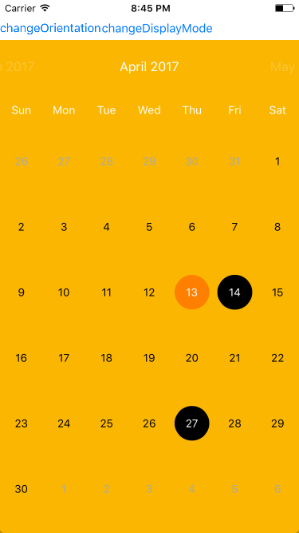
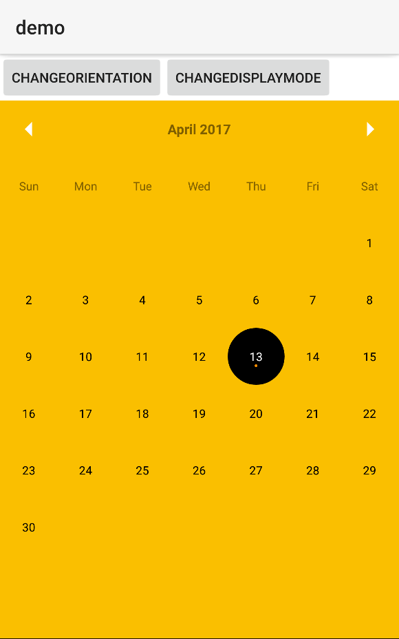

[](https://www.npmjs.com/package/nativescript-fancy-calendar)
[](https://www.npmjs.com/package/nativescript-fancy-calendar)

## NativeScript Fancy Calendar

NativeScript plugin for [iOS](https://github.com/WenchaoD/FSCalendar) and [Android](https://github.com/prolificinteractive/material-calendarview).

This plugin is not production ready, and there is still a lots of work to do on it. That's why I advise you to use the [nativescript-pro-ui](https://www.npmjs.com/package/nativescript-pro-ui) calendar which is supported by Telerik itself :beers:.


### Screenshots


  iOS    |  Android
-------- | ---------
 | 


### Install 

```bash
tns plugin add nativescript-fancy-calendar
```

### Documentation

component.html
```xml
<Calendar backgroundColor="#686B74" row="1" [settings]="settings" [events]="events" [appearance]="appearance"
        (dateSelected)="dateSelected($event)" (monthChanged)="monthChanged($event)" (loaded)="calendarLoaded($event)">
</Calendar>
```

component.ts
``` typescript
import {
    Calendar,
    SELECTION_MODE, // Multiple or single
    DISPLAY_MODE, // Week or month
    CalendarEvent, // little dots 
    Appearance, // style customisation
    SCROLL_ORIENTATION, // scroll orientation for iOS
    CalendarSubtitle, // subtitles for iOS
    Settings // Settings interface
} from 'nativescript-fancy-calendar';

registerElement('Calendar', () => Calendar);

@Component({
    selector: "ns-yourcomponent",
    templateUrl: "yourcomponent.component.html",
})
export class YourComponent {
    settings: any;
    subtitles: CalendarSubtitle[];
    events: CalendarEvent[];
    public appearance: Appearance;
    private _calendar: Calendar;
    
    public calendarLoaded(event) {
         this.settings = <Settings>{
            displayMode: DISPLAY_MODE.MONTH, 
            scrollOrientation: SCROLL_ORIENTATION.HORIZONTAL,
            selectionMode: SELECTION_MODE.MULTIPLE,
            firstWeekday: 3, // SUN: O, MON: 1, TUES: 2 etc..
            maximumDate: nextMonth, // Can't go further than this date
            minimumDate: lastMonth // can't go earlier than this date
        };
        this.appearance = <Appearance>{
            weekdayTextColor: "white", //color of Tue, Wed, Thur.. (only iOS)
            headerTitleColor: "white", //color of the current Month (only iOS)
            eventColor: "white", // color of dots
            selectionColor: "#FF3366", // color of the circle when a date is clicked
            todayColor: "#831733", // the color of the current day
            hasBorder: true, // remove border (only iOS)
            todaySelectionColor: "#FF3366", // today color when seleted (only iOS)
            borderRadius: 25 // border radius of the selection marker
        };
    }
    
    public dateSelected(event) {
        console.log('date selected');
    }


    public monthChanged(event) {
        console.log('month selected');
    }
}

``` 


